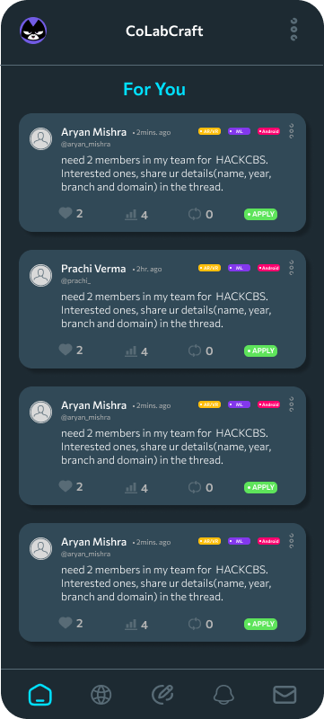
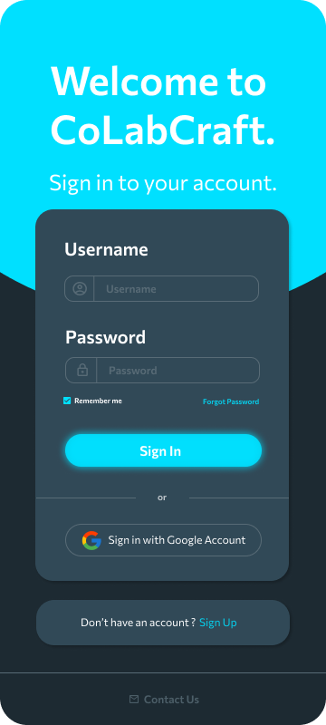

# CollabCraft

**CollabCraft** is an app designed to help users connect with potential teammates or mentors for any project, hackathon, or collaboration. Users can create posts (similar to tweets) specifying the kind of help or expertise they are looking for, and others can apply for the opportunity directly through the app.

## Features
- **Create Posts**: Users can create posts specifying the role they need, such as developers, designers, mentors, etc.
- **Apply for Opportunities**: Other users can view posts and apply for the role directly.
- **Real-time Interaction**: View and interact with open posts in real-time.
- **Manage Applications**: Users can track and manage the applications they receive for their posts.

### Tweets


### Tweets


## Tech Stack
### Frontend
- **Jetpack Compose**: Modern Android UI toolkit for building native interfaces quickly and efficiently.
  
### Backend
- **Spring Boot**: Robust backend handling data storage, user management, and interaction logic.
- **REST API**: All data communication between the frontend and backend happens via secure RESTful APIs.

## Installation & Setup
### Backend (Spring Boot)
1. Clone the repository:
    ```bash
    git clone https://github.com/your-repo/collabcraft.git
    ```
2. Navigate to the backend folder:
    ```bash
    cd backend
    ```
3. Build the backend:
    ```bash
    ./mvnw clean install
    ```
4. Run the Spring Boot application:
    ```bash
    ./mvnw spring-boot:run
    ```
5. The backend will be available at `http://localhost:8080`.

### Frontend (Jetpack Compose)
1. Open the project in **Android Studio**.
2. Sync the project to download all required dependencies.
3. Build and run the app on your preferred device or emulator.

## API Endpoints
- **POST** `/tweets/new-tweet` - Create a new post.
- **GET** `/tweets/all-tweets` - Fetch all tweets.
- **GET** `/tweets/{domain}` - Fetch all tweets for a specific domain for example:- android dev, Web Dev etc.
- **POST** `/api/apply/{objectId}` - Apply for a specific post.

> You can find a detailed list of all the API endpoints [here](API_DOCS.md).

## Contribution
Contributions are welcome! Please follow the steps below:
1. Fork the repository.
2. Create a new branch (`git checkout -b feature-xyz`).
3. Make your changes and commit them (`git commit -m 'Add feature xyz'`).
4. Push to the branch (`git push origin feature-xyz`).
5. Open a Pull Request.

## License
This project is licensed under the MIT License - see the [LICENSE](LICENSE) file for details.
